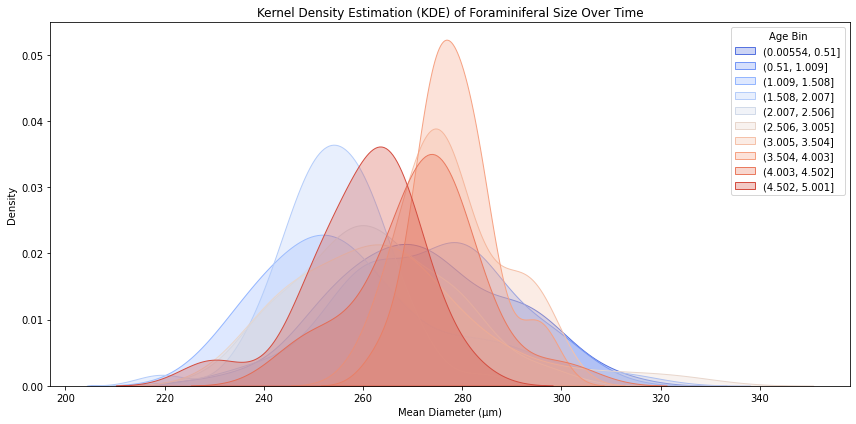
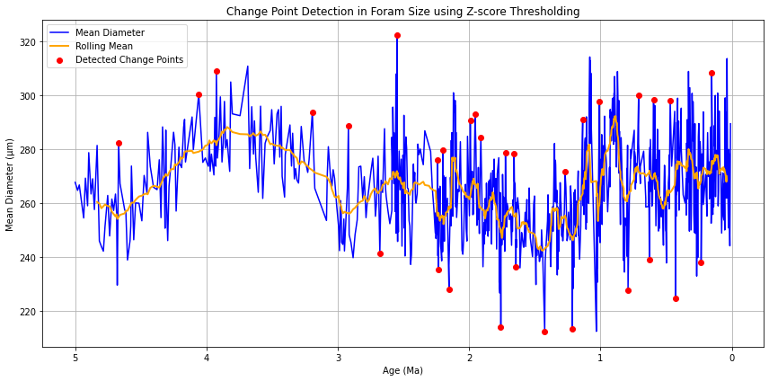

# 🐚 Morphological Diversification of Planktic Foraminifera Over Geological Time


<p align="center">
  
  
  
  
</p>

---

## 🧪 Overview

This repository hosts our academic group project on **morphological diversification in planktic foraminifera**, based on over 3 million morphometric records from deep-sea sediment cores. By analyzing this data with modern statistical and machine learning tools, we investigate evolutionary and ecological responses to climatic shifts over the last 5 million years.

> 📌 **My Role (Q1):** I was responsible for Question 1 — investigating shape distribution changes over time using statistical measures like skewness, kurtosis, and entropy. I also led data integration, binning, and the application of change point detection algorithms.

---

## ✨ Highlights

- 🧬 PCA-based morphospace analysis and shape-size clustering  
- 🧠 Shape distribution metrics: skewness, kurtosis, Shannon entropy  
- 📈 KDE ridge plots and temporal binning (5, 10, 20 bins)  
- 🔍 Change Point Detection with PELT (ruptures)  
- 🌡️ Environmental correlation with δ¹⁸O and δ¹³C proxies  
- 🔄 Periodicity analysis using Fourier, Wavelet, and Hilbert-Huang Transforms  

---

## 🔍 My Contribution: Q1 – Shape Distribution Changes Over Time

### ✅ Objective
> Are there shape distribution changes over time beyond skewness?

### 🧠 Methodology
- Cleaned and merged 377+ CSVs with Site 925 master sheet (~2.2M records)  
- Time-binned data into 10 equal-age bins (also tested 5 and 20)  
- Calculated:
  - **Skewness** – to capture asymmetry  
  - **Kurtosis** – to measure peakedness  
  - **Shannon Entropy** – to quantify distributional diversity  
- Visualized shape transitions with KDE ridge plots  
- Applied **PELT** change point detection algorithm to identify significant shifts in distribution  

### 📊 Key Insights
- Significant morphological transitions occurred around 3.2 Ma and 1.6 Ma  
- Cold periods → peaked, narrow distributions (low entropy, high kurtosis)  
- Warm periods → flatter, more diverse morphotypes  
- Entropy was a strong indicator of evolutionary broadening in shape variation  

---

## 📸 Sample Visualizations

### Morphotype Distribution Over Time
<p align="center">
  
  <br/>
  <em>KDE plots of shape parameters across 10 geological time bins.</em>
</p>

### Change Point Detection (PELT)
<p align="center">
  
  <br/>
  <em>Detected change points at 3.2 Ma and 1.6 Ma using PELT algorithm.</em>
</p>

---

## ⚙️ Technologies & Tools

- **Languages**: Python 3.10+  
- **Libraries**:
  - `pandas`, `numpy`, `seaborn`, `matplotlib`  
  - `scikit-learn`, `ruptures`, `scipy`, `statsmodels`  
- **Methods**:
  - PCA, GMM, BIC Optimization  
  - KDE Ridge Plots, Entropy Analysis  
  - Fourier & Wavelet Transform  
  - Hilbert-Huang Transform (HHT)  
  - Change Point Detection (PELT)  

---

## 🚀 Getting Started

### Clone the Repo

```bash
git clone https://github.com/yourusername/marine-morphology-evolution.git
cd marine-morphology-evolution
```
---

## 📦 Install Dependencies

```bash
pip install -r requirements.txt
```
---
## Citation
If you use this repository in your research, please cite:
# Group M9 – University of Bristol. “Morphological Diversification of Planktic Foraminifera Across Geological Timescales.” EMATM0050, 2024.
<p align="center">  </p> 
